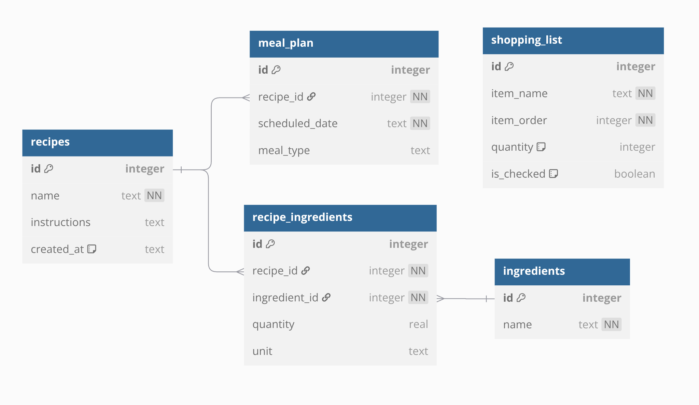

# CS50 Final Project - Meal Planner

#### Video Demo: https://youtu.be/lIeH19e5ik4?si=3EpXr3CKUBPe4jhL
#### Description:

This **React Native** mobile application is a meal planner, where a user can:

- Create their own custom recipes
- Add recipes to a meal calendar for the year
- Add and delete from a shopping list
- Add shopping items for an entire week of planned recipes

The goal was to build on my existing React knowledge and explore mobile development using React Native — a JavaScript-based framework for developing native apps on both Android and iOS.

React Native components mirror the structure of traditional React components but target native UI elements instead of web-based HTML/CSS.

Additionally, I took this project as an opportunity to practice graphic design skills. I designed UI layouts in **Figma**, created custom SVG icons using **Inkscape**, and incorporated them into the app.


### Technologies Used

- **React Native** (using expo)
- **TypeScript**
- **SQLite**
- **Figma** and **Inkscape** for design

### Design Decisions

#### Designs

- I created premade visual designs to help me to better understand what I was making throughout development
[View Design in Figma](https://www.figma.com/design/uY7rGwIt6CKME2WxiUSW1l/meal-planner?node-id=0-1&t=oF2no26HrTY0qVdF-1)

#### Database:

- Ingredients and recipe tables were normalized so they can be kept reusable and consistent
- The shopping item table was kept separate so items can be added and removed independently of the rest of the data

### React Navigation:

- Both tab and stack structures were used as this seemed logical for the designed pages
- **Expo Router** was used to automatically map files in `app/` to routes to improve scalability

### Debug

To start the application you will either need to:

- Connect a phone with the expo app installed (recommended)
- Or download and install a android phone emulator
  Run with: npm start

### Project Structure

- **app/\_layout.tsx** — Entry point, sets up database and navigation tabs
- **app/** — Tab navigation pages which include views for each page
- **assets/** — Contains custom fonts, svgs and images
- **components/** — Reusable UI components and themed comoponents
- **components/forms** — User forms to add data to the database
- **components/icons** — Converted SVG icons into React Native components
- **constants/** — Contains global variables for themes and helper functions
- **db/** — Contains database designs and schema
- **providers/** — Reusable react providers
- **views/** — These are the views for each tab or stack

### SQLite Database Design


See [`db/schema.sql`](db/schema.sql) for the schema or [`db/design.md`](db/design.md) for a visual/table summary.

---

## Notes

I used ChatGPT to help me find icons quicker, generate my SVGs into native components, search for functions in libraries, confirm database calls were correct and general debugging.

## Publish Command
```eas update --branch main --message "First publish"```
